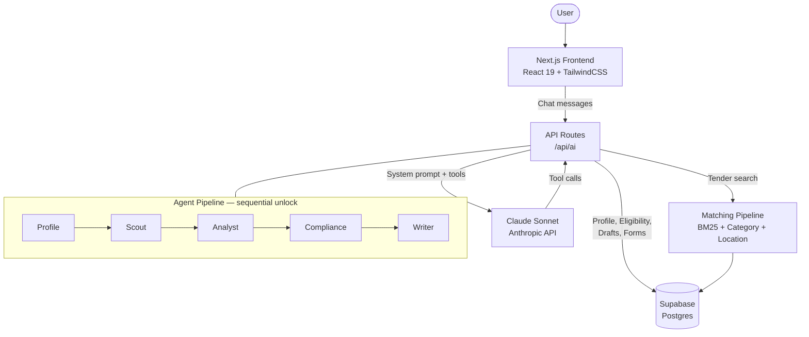

# Bidly

| | |
| --- | --- |
| Project | [](https://github.com/jiroamato/bidly/releases) [](https://nodejs.org/) [](https://github.com/jiroamato/bidly) |
| Meta | [](CODE_OF_CONDUCT.md) [](https://creativecommons.org/licenses/by/4.0/) [](https://opensource.org/licenses/MIT) |

Bidly is an Agentic-AI application that helps Canadian businesses find, understand, and bid on government tenders.

## How It Works

Bidly uses a multi-agent pipeline where each agent handles one stage of the procurement process:

| Agent | Stage | What It Does |
|-------|-------|-------------|
| **Profile** | Setup | Collects your company info (NAICS codes, location, capabilities) through conversational Q&A |
| **Scout** | Research | Searches 500+ government tenders using keyword and category matching |
| **Analyst** | Research | Breaks down RFPs into plain-language summaries: scope, deadlines, forms, evaluation criteria, risks |
| **Compliance** | Execute | Checks eligibility against Buy Canadian policy, certifications, insurance, bonding, and mandatory steps |
| **Writer** | Execute | Drafts bid proposal sections and calculates pricing with correct GST/HST/PST by province |

Agents unlock sequentially — completing one activates the next.

## Demo

Below is a short preview of the dashboard interface.


## Architecture



## Tech Stack

- **Framework:** Next.js 16.2.1 (App Router) + React 19.2.4 + TypeScript 5.9.3
- **Styling:** TailwindCSS 4.2.2 + shadcn/ui 4.1.0
- **AI:** Claude Sonnet via Anthropic SDK 0.82.0 with tool use for agentic workflows
- **Search:** BM25 + category + keyword + location scoring pipeline
- **Database:** Supabase (Postgres) via supabase-js 2.99.3
- **Data:** Canadian government open-data tender notices (2025–2026)
- **Testing:** Vitest 4.1.0

## Demo


## Deployment

| Build | URL |
|-------|-----|
| Stable (`main`) | [https://bidly.vercel.app](https://bidly.vercel.app) |
| Preview (`dev`) | [https://bidly-dev.vercel.app](https://bidly-dev.vercel.app) |

## Developer Setup

### Prerequisites

- Node.js 18+
- A Supabase project
- API keys: [Anthropic](https://console.anthropic.com/)

### 1. Clone the repository

```bash
git clone https://github.com/jiroamato/bidly.git
cd bidly
```

### 2. Install dependencies

```bash
npm install
```

### 3. Set up environment variables

Create a `.env.local` file:

```
NEXT_PUBLIC_SUPABASE_URL=your_supabase_url
NEXT_PUBLIC_SUPABASE_ANON_KEY=your_anon_key
SUPABASE_SERVICE_ROLE_KEY=your_service_role_key
ANTHROPIC_API_KEY=your_anthropic_key
API_SECRET_KEY=your_api_secret              # optional — API key gate for production
NEXT_PUBLIC_API_KEY=your_api_key            # optional — must match API_SECRET_KEY
```

### 4. Download tender data

Download the CSV from [Open Canada — Open tenders notices](https://open.canada.ca/data/en/dataset/6abd20d4-7a1c-4b38-baa2-9525d0bb2fd2) (under **"Open tenders notices"**) and save it to the project root as:

```
openTenderNotice-ouvertAvisAppelOffres.csv
```

### 5. Set up the database

Run all 3 migrations in order in your Supabase SQL Editor:

1. `supabase/migrations/001_initial_schema.sql`
2. `supabase/migrations/002_working_mvp_schema.sql`
3. `supabase/migrations/003_matching_improvements.sql`

### 6. Seed tender data

```bash
npx tsx scripts/seed-tenders.ts
```

### 7. Run the dev server

```bash
npm run dev
```

Open [http://localhost:3000](http://localhost:3000) to start using Bidly.

### 8. Run the test suite

```bash
npm run test
```

## Scripts

| Command | Description |
|---------|-------------|
| `npm run dev` | Start development server |
| `npm run build` | Production build |
| `npm run start` | Start production server |
| `npm run lint` | Run ESLint |
| `npm run test` | Run tests (Vitest) |
| `npm run test:watch` | Run tests in watch mode |
| `npx tsx scripts/seed-tenders.ts` | Import tenders from CSV into Supabase |

## Project Structure

```
src/
├── app/api/          — API routes (ai, analyze-tender, check-compliance, drafts, eligibility, forms, profile, tenders)
├── components/       — UI components (sidebar, header, chat input/panel, markdown, agent views)
│   ├── ui/           — shadcn/ui primitives
│   └── views/        — Agent-specific views (profile, scout, analyst, compliance, writer)
├── contexts/         — React contexts (chat history)
├── hooks/            — React hooks (agent state machine, chat messaging, demo script)
├── lib/              — Core logic
│   ├── ai/           — AI integration (prompts, tools, tool handlers, context builder)
│   └── matching/     — Tender matching (BM25, category, keyword, location scorers)
├── middleware.ts     — API key gate for /api/* routes
scripts/              — Data pipeline (CSV seeding)
supabase/migrations/  — Database schema (3 migrations)
```

## Team

Built by **jiroamato**, **claudia-liauw**, **vytphan**, and **will-chh** at a 2026 hackathon.
